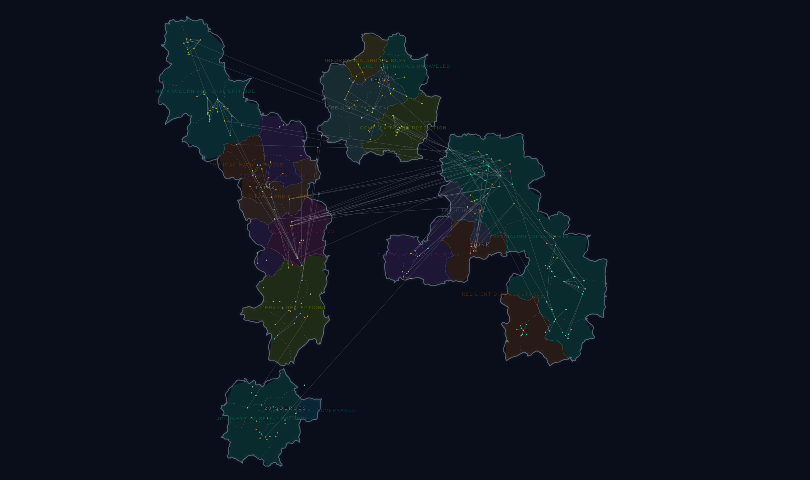
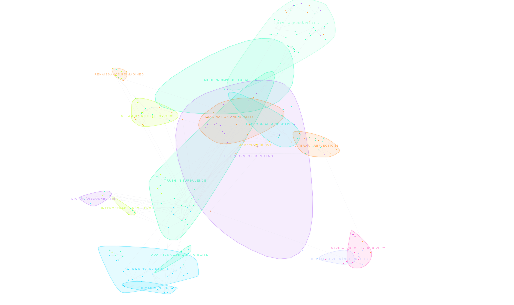
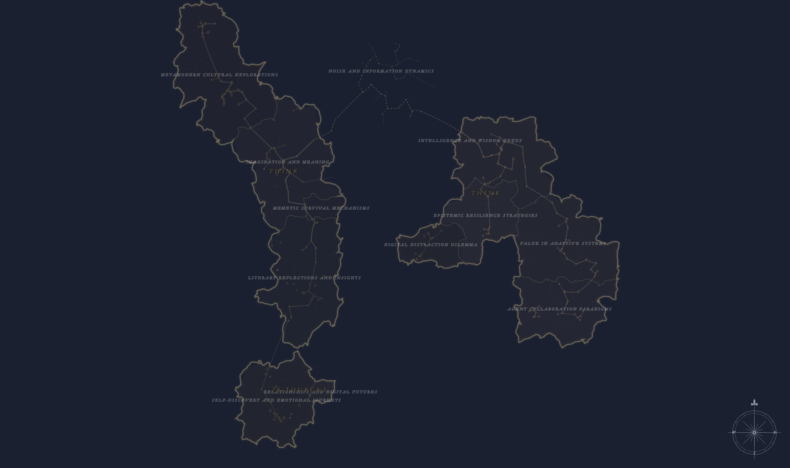
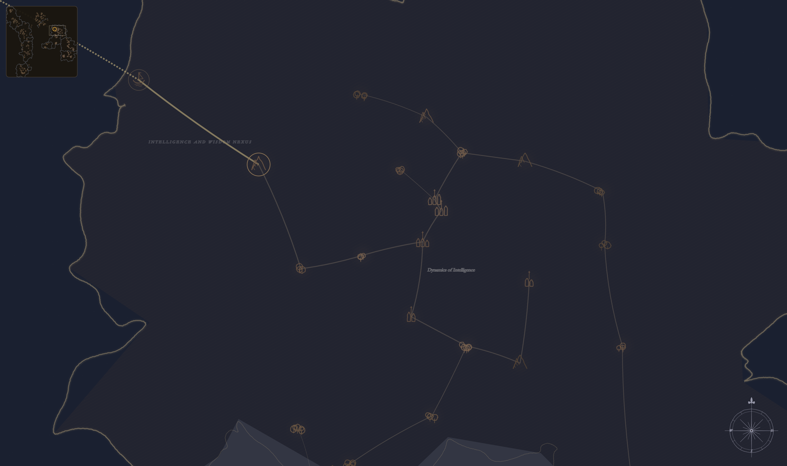
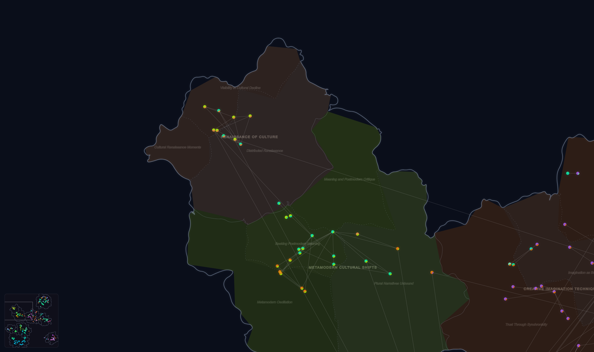
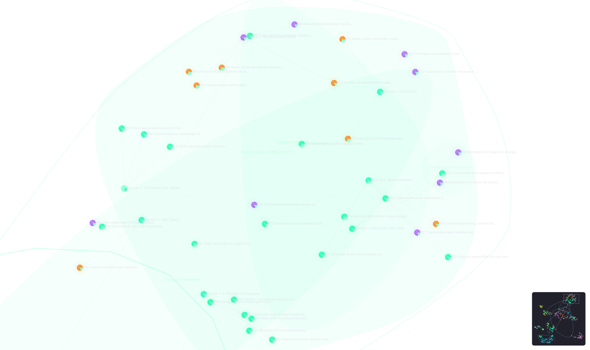

# Chorographia

Born too late to explore the world, too early to explore the stars, born just in time to explore your own thoughts projected onto a 2D map using embeddings.

Chorographia turns your Obsidian vault into an interactive semantic map. Each note becomes a point in space, placed not by folder or link structure, but by *meaning*. Notes about similar topics cluster together. The result is a living atlas of your knowledge: you can see where your thinking concentrates, where the gaps are, and how distant ideas relate.

## How it works

1. **Index** -- Select which notes to include using glob patterns, folder filters, tag filters, or frontmatter conditions
2. **Embed** -- Each note is converted into a high-dimensional vector by an embedding model (Ollama, OpenAI, or OpenRouter)
3. **Project** -- UMAP reduces those vectors down to 2D coordinates
4. **Cluster** -- K-means groups nearby embeddings into semantic zones
5. **Name** -- Optionally, an LLM reads the note titles in each zone and generates an evocative region name

The map is rendered on an HTML canvas you can pan, zoom, and click through.

## Map styles

Chorographia offers two distinct ways to render zones on your map.

### Star map

Overlapping smooth blobs with soft, translucent zone boundaries. Points float in space with glowing halos. Good for seeing how topics blend into each other.

### World map

Non-overlapping country shapes with fractal coastlines, continent grouping, and province sub-divisions. Zones become territories separated by sea. Tunable parameters control land density, continental unity, and coast ruggedness.

## Themes

Two built-in visual themes:

- **Default** -- Bright saturated palette on a dark background, neon zone colors, sharp labels
- **17th-Century Cartography** -- Muted parchment tones, engraved-style lettering, compass rose, and grid lines. Designed to evoke period maps

Both themes support light and dark Obsidian base themes.

## Features

### Semantic zones

Color-coded regions drawn behind the points using k-means clustering. Zone granularity is adjustable from 3 to 24 clusters. Each zone gets an auto-generated label from its most representative note titles, and optionally an LLM-generated name.

### Sub-zones

Zones are further divided into provinces that appear as you zoom in. Sub-zones get their own labels and can also be named by the LLM.

### Navigation

Click any point to open the corresponding note and re-center the view. Walk through your vault spatially, discovering notes by proximity rather than by name. A minimap in the corner shows your current viewport position.

### Link overlay

Wikilink edges rendered between notes on the map. Hover or select a note to highlight its direct connections.

### Color modes

Three ways to color the points:

- **Semantic** -- Colors derived from k-means cluster assignment, blending two cluster colors per note based on membership weight
- **Folder** -- Each top-level folder gets a unique color from the theme palette
- **Property** -- Color by any frontmatter field (e.g. `type`, `status`, `category`)

### File explorer dots

Colored circles appear next to notes in Obsidian's file explorer, matching their map color. The dots update automatically as you scroll through the file tree.

### Map lock

Freeze note positions, cluster assignments, and zone names so the map stays stable as you add new notes. New notes are placed by nearest-neighbor interpolation into existing clusters.

### PNG export

Export the map as a high-resolution PNG. Three modes:

- **Current view** -- Exports exactly what you see on screen
- **Whole map** -- Renders the entire map at full scale
- **Select region** -- Draw a rectangle on the map and export just that area

Export options include toggles for zone labels, sub-zone labels, note titles, and links, with scale multipliers (1x, 2x, 4x).

### Snapshots

Save and restore complete map states including all settings, cache data, and layout coordinates. Useful for preserving a known-good map before re-embedding or for comparing different configurations.

### Setup wizard

A guided onboarding modal walks new users through provider setup, note selection, map style preferences, and launches the first embedding run. Opens automatically when the map view detects an empty cache, or manually from Settings.

### Mobile support

Touch gestures for pan and pinch-to-zoom on tablets and phones.

## Getting started

### Installation (BRAT)

1. Install the [BRAT](https://github.com/TfTHacker/obsidian42-brat) plugin
2. In BRAT settings, add `teleologia/chorographia` as a beta plugin
3. Enable "Chorographia" in Obsidian's community plugins settings

### Manual installation

1. Download `main.js`, `manifest.json`, and `styles.css` from the latest release
2. Place them in your vault's `.obsidian/plugins/chorographia/` directory
3. Enable "Chorographia" in Obsidian's community plugins settings

### First run

On first opening the map, the setup wizard will guide you through configuration. Alternatively:

1. Open Chorographia settings
2. Choose your embedding provider (Ollama is the default, fully local, no API key needed)
3. Set your include/exclude glob patterns to select which notes to index
4. Run "Re-embed changed notes" from the Actions section
5. Open the map with the ribbon icon or the "Open Chorographia map" command

## Embedding providers

**Ollama (local)** -- Runs entirely on your machine. Point it at your local Ollama server and pick an embedding model (default: `qwen3-embedding`). No data leaves your computer.

**OpenAI** -- Uses OpenAI's embedding API (default model: `text-embedding-3-large`). Requires an API key.

**OpenRouter** -- Access a variety of embedding models through OpenRouter (default model: `openai/text-embedding-3-small`). Requires an API key from [openrouter.ai](https://openrouter.ai).

All three providers support configurable batch sizes to balance throughput against rate limits.

## Zone naming providers

When LLM zone naming is enabled, a separate provider can be configured independently from the embedding provider:

- **Ollama** -- Default model: `qwen3:8b`
- **OpenAI** -- Default model: `gpt-5-mini`
- **OpenRouter** -- Default model: `google/gemini-2.0-flash-001`

## Settings reference

### Providers

| Setting | Description |
|---------|-------------|
| Ollama URL | Base URL for the local Ollama server |
| OpenAI API key | API key for OpenAI services |
| OpenRouter API key | API key for OpenRouter services |

### Embedding model

| Setting | Description |
|---------|-------------|
| Provider | Ollama, OpenAI, or OpenRouter |
| Embedding model | Model name or ID for the selected provider |
| Batch size | Notes per embedding request (1-100) |

### Note selection

| Setting | Description |
|---------|-------------|
| Include globs | Comma-separated glob patterns for notes to index (default: `**/*.md`) |
| Exclude globs | Comma-separated glob patterns to skip (default: `templates/**`) |
| Include folders | Restrict to specific top-level folders |
| Exclude folders | Skip specific top-level folders |
| Include tags | Only include notes with at least one of these tags |
| Exclude tags | Skip notes with any of these tags |
| Require property | Only include notes with a specific frontmatter property, optionally with a specific value (`key` or `key:value`) |
| Max notes | Safety cap on the number of notes to index (default: 2000) |

### Embedding content

| Setting | Description |
|---------|-------------|
| Frontmatter fields | Which frontmatter fields to include in the text sent to the embedding model (default: `title, type, cat, topics`) |
| Include tags | Whether to append tags to the embedding text |

### Semantic zones

| Setting | Description |
|---------|-------------|
| Show semantic zones | Toggle zone rendering on the map |
| Zone granularity | Number of k-means clusters (3-24) |
| Zone style | Star map or world map rendering |
| Land density | World map: how much of the surface becomes land vs. sea |
| Continental unity | World map: how far clusters reach to merge (archipelago to pangea) |
| Coast ruggedness | World map: smoothness of coastlines (beaches to fjords) |
| LLM zone naming | Use an LLM to generate zone and sub-zone names |
| Zone naming provider | Which LLM provider to use for naming |
| LLM model | Model name for the selected naming provider |
| Lock map | Preserve positions, assignments, and names across re-embeds |

### Map display

| Setting | Description |
|---------|-------------|
| Theme | Default or 17th-Century Cartography |
| Color mode | Semantic, folder, or property-based coloring |
| Color property field | Frontmatter field for property coloring |
| Show link overlay | Draw wikilink edges between notes |
| File explorer dots | Show colored circles in the file explorer |
| Dot offset | Left offset for explorer dots |
| Minimap corner | Position of the minimap (or off) |

### Label appearance

| Setting | Description |
|---------|-------------|
| Zone label size | Font size for zone names (6-18 px) |
| Zone label opacity | Transparency of zone labels |
| Sub-zone label size | Font size for sub-zone names (4-14 px) |
| Sub-zone label opacity | Transparency of sub-zone labels |
| Note title size | Font size for note titles (3-12 px) |
| Note title opacity | Transparency of note titles |
| Label outline | Add a contrasting outline for readability |
| Outline width | Thickness of the label outline (1-4 px) |

### Actions

| Action | Description |
|--------|-------------|
| Setup wizard | Open the guided onboarding modal |
| Re-embed changed notes | Index and compute embeddings for new or changed notes |
| Recompute layout | Run UMAP on cached embeddings to generate a new 2D layout |
| Re-run zone naming | Regenerate LLM names for all zones and sub-zones |
| Clear cache | Delete all cached embeddings and layout data |

## Network usage

Chorographia sends note content to external services only when you choose a cloud provider:

- **OpenAI** -- Note text (title + selected frontmatter fields + body) is sent to `api.openai.com/v1/embeddings` for embedding, and optionally to `api.openai.com/v1/chat/completions` for zone naming.
- **OpenRouter** -- Same note text is sent to `openrouter.ai/api/v1/embeddings` and optionally `openrouter.ai/api/v1/chat/completions`.
- **Ollama** -- All requests stay on your local machine (`localhost:11434` by default). No data leaves your computer.

No telemetry, analytics, or tracking data is collected or transmitted.

## License

[MIT](LICENSE)
